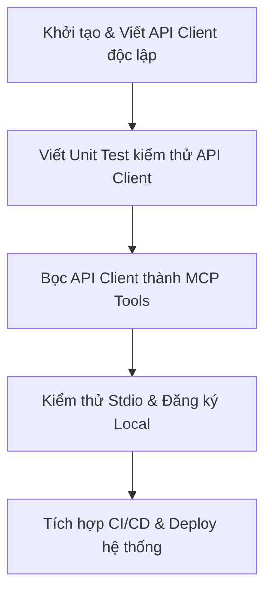

# Hướng dẫn Toàn diện Xây dựng MCP Server (Base Guide cho Người mới)

Tài liệu này cung cấp khung lý thuyết và quy trình thực hành từ con số 0 để xây dựng một MCP (Model Context Protocol) Server chất lượng cao, an toàn và tối ưu cho bất kỳ API hoặc dịch vụ nào.

---

## 1. Tìm hiểu Khái niệm Cốt lõi của MCP

Model Context Protocol (MCP) là một giao thức mã nguồn mở cho phép các AI Agent (như Claude Desktop, Claude Code, Cursor) kết nối an sau dữ liệu và các công cụ bên ngoài. Hãy hình dung MCP giống như một **"Driver" (trình điều khiển)** giúp hệ điều hành AI tương tác được với thế giới bên ngoài.

MCP Server bao gồm 3 thành phần chính:
1. **Tools (Công cụ)**: Các hàm thực thi mã nguồn mà AI Agent có thể **chủ động gọi** (ví dụ: tạo đơn hàng, gửi email, truy vấn cơ sở dữ liệu). Tool có tính động (Dynamic).
2. **Resources (Tài nguyên)**: Các nguồn dữ liệu tĩnh hoặc bán tĩnh mà AI Agent có thể **đọc** làm ngữ cảnh (ví dụ: file log, tài liệu hướng dẫn API, ER diagram). Resource giống như các file tài liệu.
3. **Prompts (Biểu mẫu gợi ý)**: Các mẫu câu lệnh định sẵn giúp người dùng nhanh chóng bắt đầu các luồng công việc phức tạp (ví dụ: "Tóm tắt email của tuần này").

---

## 2. Giai đoạn 1: Nghiên cứu API & Xác định Giới hạn (API Discovery)

Trước khi viết bất kỳ dòng code nào, bạn cần nghiên cứu kỹ hệ thống/API mà bạn muốn bọc (wrap) thành MCP Server.

### Checklist nghiên cứu API:
- [ ] **Cơ chế xác thực (Authentication)**: API sử dụng API Key, Bearer Token (JWT), OAuth2, hay Basic Auth?
  - *Nguyên tắc bảo mật*: Không bao giờ lưu cứng (hardcode) thông tin xác thực. Hãy dùng thư viện nạp biến môi trường (như `python-dotenv` hoặc `dotenv` trong Node.js) để đọc từ file `.env` hoặc hệ thống quản lý secrets.
- [ ] **Tài liệu API Endpoints**: Các API nào cần thiết cho nghiệp vụ của bạn?
  - Phân loại: Hành động nào là chỉ đọc (Read - GET) và hành động nào là ghi dữ liệu (Write - POST, PUT, DELETE).
- [ ] **Giới hạn tốc độ (Rate Limits)**: API cho phép gọi tối đa bao nhiêu request trên một phút?
  - Thiết kế MCP cần tích hợp cơ chế tự động thử lại với thời gian chờ tăng dần (Exponential Backoff) để tránh bị chặn IP.
- [ ] **Cơ chế Phân trang (Pagination)**: Khi truy vấn danh sách (ví dụ: danh sách sản phẩm), API phân trang theo kiểu Offset hay Cursor?
  - AI Agent rất dễ bị tràn ngữ cảnh (context window) nếu dữ liệu trả về quá lớn. Cần thiết kế Tool có tham số giới hạn số lượng (`limit`) và hỗ trợ phân trang để AI có thể lấy dữ liệu theo từng lô (batch).
- [ ] **Định dạng & Dung lượng Dữ liệu (Data Payload)**: Phản hồi của API chứa những thông tin gì?
  - Dữ liệu thô từ các hệ thống lớn thường rất rác và chứa nhiều trường thừa. Hãy lên kế hoạch lọc bớt các trường không cần thiết trước khi trả kết quả về cho AI để tiết kiệm Token và tăng độ chính xác.

---

## 3. Giai đoạn 2: Thiết kế Giao diện MCP (Tools, Resources, Prompts)

Đây là bước thiết kế "hợp đồng" (contract) giữa AI Agent và MCP Server của bạn.

### 3.1. Thiết kế Tools (Hành động)
AI Agent nhận diện Tool dựa hoàn toàn vào **Tên Tool**, **Mô tả Tool (Docstring)** và **Kiểu dữ liệu đầu vào (Schema)**.
- **Tên Tool**: Đặt tên rõ ràng, mang tính động từ và nhất quán (ví dụ: `search_products`, `create_invoice`, `send_slack_message`).
- **Mô tả Tool (Docstring/Description)**: Phải cực kỳ chi tiết. Nêu rõ:
  - Tool này dùng để làm gì?
  - Khi nào AI nên gọi tool này?
  - Ý nghĩa của từng tham số đầu vào là gì?
- **Tham số đầu vào (Arguments)**: Sử dụng các kiểu dữ liệu cơ bản (string, integer, boolean, float). Khai báo rõ ràng tham số nào là bắt buộc, tham số nào là tùy chọn (có giá trị mặc định).
- **Dữ liệu trả về (Output)**:
  - Nên bọc dữ liệu trả về dưới dạng chuỗi văn bản có cấu trúc (JSON string là tốt nhất).
  - Tránh trả về các Object Python hoặc đối tượng phức tạp mà AI không tự parse được.

### 3.2. Thiết kế Resources (Dữ liệu tham khảo)
Hãy xác định xem có tài liệu hoặc thông tin ngữ cảnh nào cần cung cấp cho AI dưới dạng Resource tĩnh hay không:
- Định nghĩa URI Scheme để AI truy cập (ví dụ: `api-docs://endpoints/reference`).
- Chỉ định rõ định dạng (Mime-type) là `text/markdown` hoặc `application/json` để AI dễ đọc.

---

## 4. Giai đoạn 3: Lập kế hoạch Triển khai (Planning & Architecture)

Hãy chia nhỏ quá trình phát triển thành các pha để dễ dàng kiểm soát và sửa lỗi:



### Chi tiết luồng lập kế hoạch:
1. **Pha 1: Viết SDK/API Client thuần**: 
   - Viết một class Python hoặc module Node.js độc lập để thực hiện các cuộc gọi HTTP đến API bên thứ ba. 
   - Tách biệt hoàn toàn phần giao thức MCP ra khỏi logic kết nối API.
2. **Pha 2: Viết mã nguồn kiểm thử (Unit Test/Scripts)**:
   - Viết các script nhỏ để chạy thử API Client bằng tay để chắc chắn rằng cơ chế kết nối mạng, xác thực và các tham số truyền đi hoạt động chính xác.
3. **Pha 3: Viết mã nguồn MCP Wrapper**:
   - Sử dụng thư viện MCP (FastMCP cho Python hoặc MCP SDK cho Node.js).
   - Đăng ký các hàm của API Client thành các `@mcp.tool()` hoặc `@mcp.resource()`.
4. **Pha 4: Thiết kế cơ chế An toàn & Khôi phục (Resilience & Security)**:
   - **Xử lý ngoại lệ (Error Handling)**: Bọc toàn bộ các hoạt động của tool trong khối `try-catch`. Khi lỗi xảy ra, thay vì để chương trình bị crash, hãy bắt lỗi và trả về một chuỗi JSON mô tả lỗi rõ ràng để AI có cơ hội tự sửa sai hoặc báo lại cho người dùng.
   - **Input Validation**: Luôn kiểm tra tính hợp lệ của tham số do AI truyền vào (ví dụ: kiểm tra chuỗi rỗng, kiểu dữ liệu, các ký tự đặc biệt) để tránh các lỗ hổng bảo mật như SQL Injection hay Command Injection.

---

## 5. Giai đoạn 4: Viết code (Implementation)

Dưới đây là một khung mã nguồn chuẩn sử dụng thư viện **FastMCP** trong Python để xây dựng một MCP Server hoàn chỉnh:

### Cấu trúc thư mục khuyến nghị:
```
my-mcp-server/
├── .env.example
├── .env
├── requirements.txt
├── client.py             # Lớp API Client tương tác thô với API bên thứ ba
├── server.py             # Khởi tạo MCP và đăng ký tools/resources
└── README.md
```

### File `requirements.txt`:
```text
mcp[cli]>=1.0.0
fastmcp>=0.4.1
python-dotenv>=1.0.1
requests>=2.31.0
```

### File `client.py` (API Client kết nối API thô):
```python
# client.py
import requests

class ThirdPartyClient:
    def __init__(self, api_url: str, api_key: str):
        self.api_url = api_url.rstrip('/')
        self.headers = {
            "Authorization": f"Bearer {api_key}",
            "Content-Type": "application/json"
        }
        self.session = requests.Session()

    def get_items(self, category: str, limit: int = 10):
        url = f"{self.api_url}/v1/items"
        params = {"category": category, "limit": limit}
        response = self.session.get(url, headers=self.headers, params=params, timeout=10)
        response.raise_for_status()
        return response.json()
```

### File `server.py` (Đăng ký MCP Server):
```python
# server.py
import os
import json
from dotenv import load_dotenv
from mcp.server.fastmcp import FastMCP
from client import ThirdPartyClient

# Load môi trường
load_dotenv()

# Khởi tạo MCP Server
mcp = FastMCP(
    name="my-api-service",
    instructions="Chào mừng bạn đến với My API Service MCP. Server này cung cấp các công cụ truy vấn dữ liệu sản phẩm.",
)

# Khởi tạo client kết nối thô
def get_client() -> ThirdPartyClient:
    url = os.getenv("API_URL")
    key = os.getenv("API_KEY")
    if not url or not key:
        raise ValueError("Thiếu cấu hình API_URL hoặc API_KEY trong biến môi trường.")
    return ThirdPartyClient(url, key)

# Đăng ký Tool
@mcp.tool()
def search_items(category: str, limit: int = 5) -> str:
    """
    Truy vấn danh sách vật phẩm từ hệ thống bên thứ ba theo danh mục.

    Args:
        category: Tên danh mục cần tìm kiếm (ví dụ: 'electronics', 'books').
        limit: Số lượng bản ghi tối đa muốn lấy về (mặc định: 5, tối đa: 50).
    """
    try:
        client = get_client()
        data = client.get_items(category=category, limit=limit)
        
        # BẮT BUỘC: Trả về chuỗi JSON string để AI dễ phân tích
        return json.dumps(data, ensure_ascii=False, indent=2)
    except Exception as e:
        # Xử lý lỗi an toàn, không crash server
        return json.dumps({"status": "error", "message": str(e)}, ensure_ascii=False)

if __name__ == "__main__":
    # transport mặc định is stdio khi chạy để AI client tích hợp trực tiếp
    mcp.run()
```

---

## 6. Giai đoạn 5: Kiểm thử & Tích hợp (Testing & Integration)

Sau khi viết code xong, bạn cần chạy thử nghiệm để đảm bảo AI Agent có thể giao tiếp mượt mà với server của bạn thông qua luồng Input/Output chuẩn (`stdio`).

### 6.1. Sử dụng MCP Inspector để Debug (Khuyên dùng)
Đây là công cụ GUI trực quan do đội ngũ phát triển MCP cung cấp để bạn chạy thử nghiệm:
1. Đảm bảo bạn đã cài Node.js.
2. Chạy lệnh sau trong thư mục chứa server của bạn:
   ```bash
   npx @modelcontextprotocol/inspector python server.py
   ```
3. Công cụ sẽ tự động chạy server của bạn và mở một trang web UI tại trình duyệt. Tại đây, bạn có thể click chọn từng Tool, điền tham số trực quan và xem kết quả JSON trả về.

### 6.2. Đăng ký vào AI Client Local

Để tích hợp MCP Server của bạn vào các AI Editor thông dụng:

#### 1. Đăng ký vào Claude Desktop
Mở file cấu hình của Claude Desktop:
- **Windows**: `%APPDATA%\Claude\claude_desktop_config.json`
- **macOS**: `~/Library/Application Support/Claude/claude_desktop_config.json`

Thêm cấu hình server của bạn vào thẻ `mcpServers`:
```json
{
  "mcpServers": {
    "my-api-service": {
      "command": "python",
      "args": [
        "/absolute/path/to/my-mcp-server/server.py"
      ],
      "env": {
        "API_URL": "https://api.example.com",
        "API_KEY": "your-api-key-here"
      }
    }
  }
}
```
Khởi động lại ứng dụng Claude Desktop. Bạn sẽ nhìn thấy biểu tượng cái phích cắm (plug) xuất hiện, tức là AI đã nhận diện thành công các công cụ mới của bạn!

#### 2. Đăng ký vào Cursor Editor
1. Vào **Cursor Settings** -> **Features** -> cuộn xuống phần **MCP**.
2. Click **+ Add New MCP Server**.
3. Điền các thông tin:
   - **Name**: `my-api-service`
   - **Type**: Chọn `command` (stdio).
   - **Command**: `python /absolute/path/to/my-mcp-server/server.py`
4. Click **Save** và quan sát trạng thái kết nối chuyển sang màu xanh lá cây (Connected).
